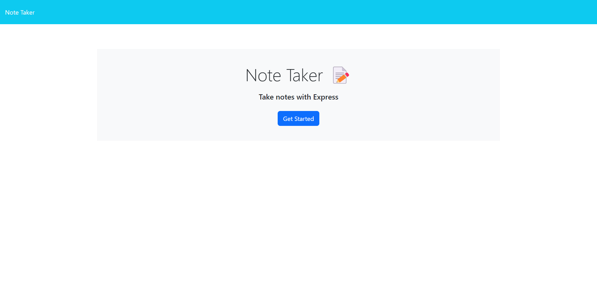
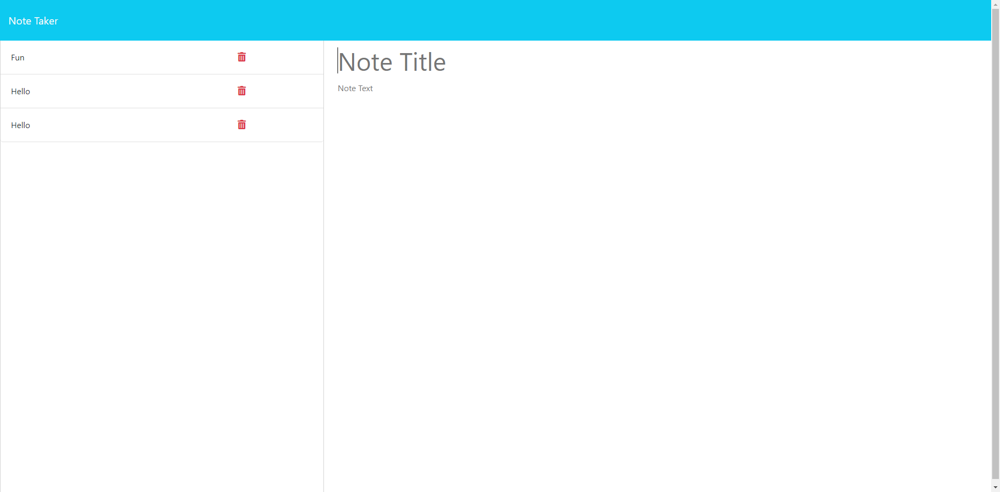

# Note Taker Challange

## What is the purpose?

The purpose of this challange was to, fix the given code so that it allows a user to enter notes to the notes page.

## How was it accomplished?

- The user is presented with a landing page
- When the user clicks the get started button the user is directed to the correct page.
- The user is able to enter a new note and when they click the save note button the note is saved on the left side of the page.

## Screenshots

## Links

[Live URL](https://note-taker-challange.onrender.com/)

[GitHub Repo](https://github.com/Bryson987081/note-taker-challange)